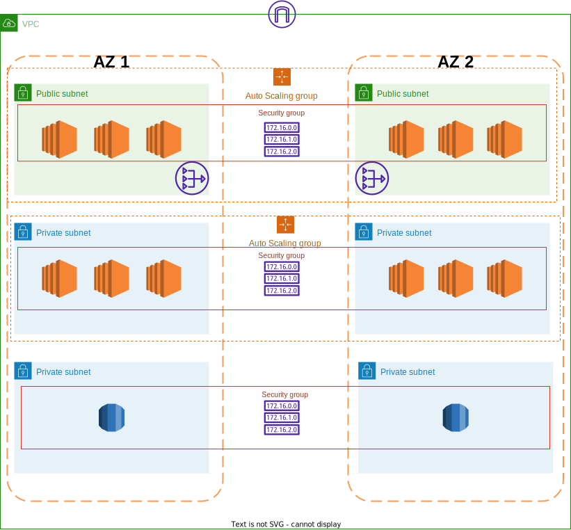

## <center> VPC with 3 Tier Architecture </center>

### Architecture Diagram



### Prerequisites

> Terraform installed on your machine <br />
> AWS CLI installed on your machine

### Steps to follow

1. Clone the repository

2. Use

   ```bash
   aws configure
   ```

   to configure your aws credentials

3. Use

   ```bash
   cd 3_tier_architecture
   ```

   to go to the directory

4. Use

   ```bash
   terraform init
   ```

   to initialize the terraform

5. Use

   ```bash
    terraform plan
   ```

   to see the changes that will be made

6. Use
   ```bash
     terraform apply
   ```
   to apply the changes
