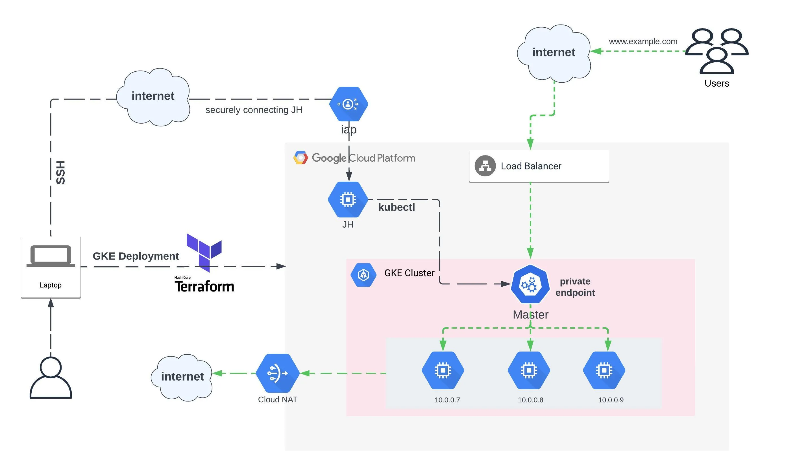

## <center> GKE Cluster </center>

### Description

A terraform script to create an isolated GKE cluster without any public access. only to be accessed by the internal jump-host server.

### Architecture



### Prerequisites

> Terraform installed on your machine <br />
> GCloud CLI installed on your machine

### Steps to follow

1. Clone the repository

2. Use

   ```bash
   gcloud auth login
   ```

   to configure your gcp account

3. Use

   ```bash
   cd private_gke
   ```

   to go to the directory

4. Use

   ```bash
   terraform init
   ```

   to initialize the terraform

5. Use

   ```bash
    terraform plan
   ```

   to see the changes that will be made

6. Use
   ```bash
     terraform apply
   ```
   to apply the changes
